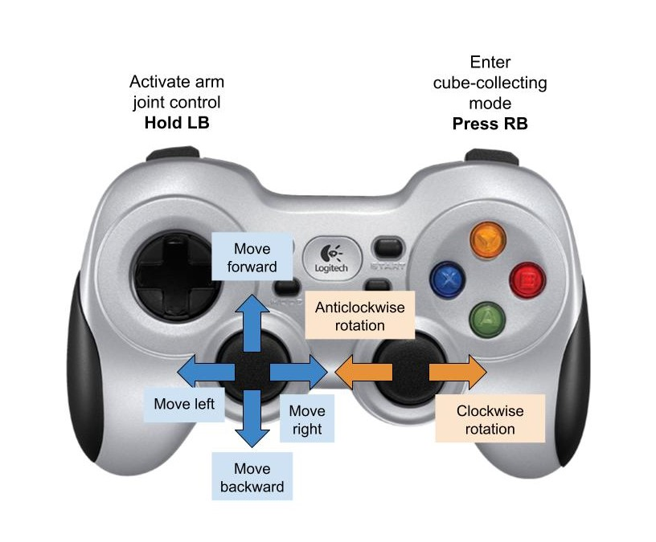

# SquirrelBot

Fundamentals of Robotics Spring 2025 - Olin College

Alana MacKay-Kao, Brooke Moss, Miranda Pietraski

## Overview
A project of our own design, SquirrelBot is a HiWonder 5-DOF robot arm platform with a basket attached to the back of its chassis. It drives around, identifies colored blocks on the ground, grasps them, and deposits them into its basket.


We accomplished this by implementing:
- a tele-op drive mode where the operator can drive the robot's mecanum wheels, allowing for omnidirectional movement
- image processing to take a distorted image from the robot arm's attached camera and identify the centroids of colored blocks
- a transformation from pixel coordinates to the robot base coordinate frame to determine where the block is
- quintic trajectory generation to ensure the gripper does not knock the block out of the way on its way to grasp it
- inverse kinematics to move the robot arm between each waypoint in the trajectory generated

See our detailed report including the theory of our methodology and details of our implementation [here.](https://docs.google.com/document/d/1WpeKHCDsXACtsWLT4E-XT1ArC7pLcC4qpy8NP0_s7yI/edit?usp=sharing)

## Setup
Much of this is the same as Kene Mbanisi's instructions [here.](https://github.com/OlinCollege-FunRobo/hiwonder-armpi-pro).

#### Step 0: Connect to Raspberry Pi over SSH
- Run `ssh funrobot@funrobot#.local` in terminal, replacing `#` with the number of your SD card.
  [Find your SD card number](https://docs.google.com/spreadsheets/d/1oiZmZgGmFAW9nbCus0FoESnCpqEN_4TZb9X0I5U4Vjc/).
  **The password is `FunR0b0!`** 
- SSH troubleshooting:
  - Make sure you are connected to the Olin Robotics network (It should work on Olin, but Olin Robotics may be faster/more stable).
  - Make sure OpenSSH Client and OpenSSH Server are installed (should be installed by default on Mac/Linux, may need to be installed under `Settings > System > Optional Features` in Windows).
  - Make sure the OpenSSH folder is added to your path. Should be `C:\Windows\System32\OpenSSH` in Windows.
  - Check the SD card to make sure the number physically written on it matches what you expect.

#### Step 1: Create a virtual environment
- We strongly recommend that you create a new python virtual environment for all your work on the platform.
- Follow this [tutorial here](https://docs.python.org/3/tutorial/venv.html).


#### Step 2: Get this repository from Github
- Follow [this tutorial](https://ftc-docs.firstinspires.org/en/latest/programming_resources/tutorial_specific/android_studio/fork_and_clone_github_repository/Fork-and-Clone-From-GitHub.html) to understand how to fork and clone repositories


#### Step 3: Install all required Python packages
```bash
# first: make sure you have activated the virtual environment. See step 1 tutorial

# cd to the project folder
$ cd squirrelbot

# install all required packages from requirements.txt
$ pip install -r requirements.txt
```

## Operation

- Before you run any script, please initialize the **pigpiod module**
``` bash
$ sudo pigpiod
```

- If setup worked well, you should be able to run the main script with the command below:
``` bash
$ sudo venv/bin/python main.py 
# this runs the main script using admin privileges and the virtual environment's python interpreter.
# N.B.: Please make sure you set the right path for your virtual environment's python interpreter above
```
SquirrelBot's control loop is as follows:


When ```main.py``` is run, the robot is in the tele-op driving mode by default. The left joystick can be used to drive in any direction you pull it in, and the right joystick can be used to turn.



When the operator believes there is likely a cube in the robot's camera's view, RB can be pressed once and the robot will enter the cube collection mode. This includes processing the current frame, collecting a cube if it has found one, and returning to the home position. When it has returned to the home position, it returns to the general control loop which allows the operator to drive the robot around again.

Though manual arm joint control shouldn't be necessary for operation of this robot, it is included. If holding the LB button on the gamepad, the operator can move the joints with these commands:


To exit this mode, simply release the LB button.

## Demo
Watch our full [demo video here.](https://drive.google.com/file/d/1Oh_T3XA_NGibS9IBfSIO8INawrqKfe2s/view?usp=sharing)